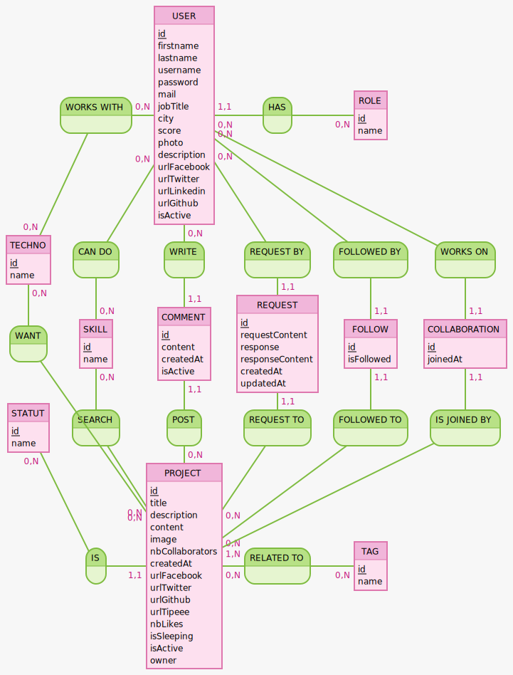

# Cahier des charges

[1. Présentation d'ensemble du projet](#1)
* [Qu'est-ce que c'est ?](#1.1)
* [Pour qui ?](#1.2)
* [Pourquoi ?](#1.3)
* [Comment ?](#1.4)

[2. Fonctionnalités](#2)
* [2.1. MVP - version 1](#2.1)
* [2.2. Fonctions sociales](#2.2)
* [2.3. Modération - version 3](#2.3)
* [2.4. Arborescence](#2.4)
* [2.5. Charte graphique](#2.5)

[3. Documents techniques](#3)
* [3.1 Users stories](#3.1)
* [3.2 Wireframes](#3.2)
* [3.3 Dictionnaire des données](#3.3)
* [3.4 Modèle conceptuel de données](#3.3)

# 1. Présentation d'ensemble du projet 

## Qu'est-ce que c'est ? 

CodeWithMe est une plateforme qui permet de centraliser des propositions de projets web et constituer des équipes en vue de leur réalisation.

## Pour qui ? 

Ce site répond particuliérement aux besoins des étudiants ou des profils juniors dans le domaine de la programmation web qui souhaitent exerçer leurs compétences techniques, collaboratives et organisationnelles en participant à des projets de leur choix. Mais aussi à des profils plus expérimentés qui souhaitent aider un concept à aboutir ou s'initier de nouvelles technologies.

## Pourquoi ? 

La finalité principale étant de pallier au manque d'expériences professionnelles des nouveaux arrivant sur le marché du travail en leur fournissant l'occasion de montrer l'étendue de leurs capacités en garnissant leur porfolio ou leur compte Github de projets personnels auxquels ils ont participés.

## Comment ? 

Ce site est un réseau social minimaliste qui permet à ses utilisateurs d'expliquer une idée plus ou moins précise d'un projet dans le domaine du web (application, site, service...) afin de trouver des collaborateurs pour le mener à bien car ils ne se sentent pas en capacité de le réaliser seul (complexité, charge de travail...) ou qu'ils n'ont pas toutes les compétences techniques requises.
Les utilisateurs peuvent y créer un profil en renseignant leurs compétences ainsi que les technologies qu'ils maîtrisent, ce qui leur permet ensuite de demander à participer aux différents projets ou d'en créer un eux-même.
 

# 2. Fonctionnalités 

## 2.1. Version 1 - MVP 

### Pour les visiteurs:
* S'enregistrer ou se connecter
* Rechercher et visionner les différents projets

### Pour les utilisateurs:
* Remplir et modifier son profil utilisateur
* Visionner les autres profils utilisateurs
* Créer un projet

### Pour les créateurs d'un ou plusieurs projets:
* Modifier et/ou supprimer son projet

## 2.2. Version 2 - Fonctions sociales 

### Pour les utilisateurs:
* Demander à participer à un projet
* Liker un projet pour le suivre et augmenter sa visibilité
* Commenter un projet
* Rechercher un utilisateur

### Pour les créateurs d'un ou plusieurs projets:
* Gérer les demandes de participation de ses projets
* Modifier le statut de ses projets
* Supprimer un de ses projets

## 2.3. Version 3 - Modération 

### Pour les utilisateurs:
* Noter les anciens collaborateurs une fois le projet terminé

### Pour les créateurs d'un ou plusieurs projets:
* Suspendre son projet
* bannir un participant d'un de ses projets

### Pour les administrateurs:
* Censurer un projet, un utilisateur ou un commentaire

## 2.4. Arborescence  

## 2.5. Charte graphique 

### Logo:

* Police: Dosis extra bold
* Couleurs: #38b6ff (bleu clair) et #ffbd59 (pêche)

### Fonts:

Dosis et Lato

### Couleurs:

...

# 3. Documents techniques 

## 3.1. User stories 

### Visiteur:

| En tant que | Je veux | Afin de (optionnel) |
|--|--|--|
| Visiteur | accéder à la page d'accueil |  |
| Visiteur | accéder à la liste complète des projets |  |
| Visiteur | pouvoir trier les projets en fonctions de différents critères | trouver un ou plusieurs projets |
| Visiteur | pouvoir rechercher des projets via une barre de recherche | trouver un ou plusieurs projets |
| Visiteur | sélectionner un projet | visionner le détail |
| Visiteur | contacter et connaitre le créateur du site | |
| Visiteur | créer un compte sur le site | me connecter |

### Utilisateur:

| En tant que | Je veux | Afin de (optionnel) |
|--|--|--|
| Utilisateur | me connecter sur le site | participer ou créer un projet |
| Utilisateur | afficher mon profil | visionner mes infos et mes projets (suivis, en cours et terminés) |
| Utilisateur | modifier mon profil | me présenter en détail |
| Utilisateur | commenter ou poser une question sur un projet | donner mon avis ou demander des informations supplémentaires |
| Utilisateur | créer un projet | présenter mon idée et rechercher des collaborateurs |
| Utilisateur | mettre un j'aime sur un projet | suivre et faire remonter la visibilité du projet |
| Utilisateur | postuler sur un projet | rejoindre le projet en cas d'autorisation |
| Utilisateur | rechercher un utilisateur | visiter son profil |
| Utilisateur | visiter un profil | connaître les détails d'un utilisateur |
| Utilisateur | noter les anciens collaborateurs une fois le projet terminé | évaluer les autres utilisateurs |

### Créateur:

| En tant que | Je veux | Afin de (optionnel) |
|--|--|--|
| Créateur | supprimer mon projet | qu'il n'apparaisse plus sur le site |
| Créateur | accepter ou refuser une demande de participation | d'ajouter ou non le postulant au projet |
| Créateur | suspendre mon projet | le mettre en pause au niveau des interactions |
| Créateur | changer le statut de mon projet | informer sur le statut de mon projet |
| Créateur | bannir un membre de mon projet | le retirer de la liste des collaborateurs |

### Administrateur (modérateur du site):

| En tant que | Je veux | Afin de (optionnel) |
|--|--|--|
| Administrateur | censurer un commentaire | qu'il n'apparaisse plus sur le site |
| Administrateur | censurer un projet | qu'il n'apparaisse plus sur le site |
| Administrateur | censurer un utilisateur | qu'il ne puisse plus utiliser le site |

## 3.2. Wireframes 

### Accueil:

### Liste des projets:

### Détail d'un projet:

...

## 3.3. Dictionnaire des données 

### Projet (`Project`)

|Champ|Type|Spécificités|Description|
|-|-|-|-|
|id|INT|PRIMARY KEY, NOT NULL, UNSIGNED, AUTO_INCREMENT|L'identifiant du projet|
|title|VARCHAR(255)|NOT NULL|Le titre du projet|
|description|TEXT|NOT NULL|La description du projet|
|content|TEXT|NOT NULL|Le contenu détaillé du projet et les attentes|
|image|TEXT|NULL|L'image d'illustration du projet|
|nbCollaborators|INT|NOT NULL|Le nombre de personnes souhaitées sur le projet|
|createdAt|DATETIME|NOT NULL|La date de création du projet|
|urlFacebook|TEXT|NULL|Lien vers la page Facebook du projet|
|urlTwitter|TEXT|NULL|Lien vers la page Twitter du projet|
|urlGithub|TEXT|NULL|Lien vers le repo Github du projet|
|urlTipeee|TEXT|NULL|Lien vers le compte Tipee du projet|
|isSleeping|BOOLEAN|NOT NULL|Est-ce que le projet est en pause|
|isActive|BOOLEAN|NOT NULL|Est-ce que le projet est visible ou censuré|
|owner|entity|NOT NULL|Le propriétaire du projet|
|statut|entity|NOT NULL|Le statut du projet|
|comments|entity|NULL| Les commentaires concernant le projet|
|requests|entity|NULL|Les demandes de participation au projet|
|follows|entity|NULL|Les "likes" reçus par le projet|
|tags|entity|NULL|Les tags correspondants au projet|
|technos|entity|NULL|Les technos recherchées pour le projet|
|skills|entity|NULL|Les compétences recherchées pour le projet|

### Statut (`Statut`)

|Champ|Type|Spécificités|Description|
|-|-|-|-|
|id|INT|PRIMARY KEY, NOT NULL, UNSIGNED, AUTO_INCREMENT|L'identifiant du statut|
|name|VARCHAR(100)|NOT NULL|Le nom du statut|
|projects|entity|NULL|Les projets reliés au statut|

### Commentaire (`Comment`)

|Champ|Type|Spécificités|Description|
|-|-|-|-|
|id|INT|PRIMARY KEY, NOT NULL, UNSIGNED, AUTO_INCREMENT|L'identifiant du commentaire|
|content|TEXT|NOT NULL|Contenu du commentaire|
|createdAt|DATETIME|NOT NULL|La date de création du commentaire|
|isActive|BOOLEAN|NOT NULL|Est-ce que le commentaire n'a pas été bloquée par un administrateur|
|project|entity|NOT NULL|Le projet relatif au commentaire|
|user|entity|NOT NULL|L'utilisateur qui a posté le commentaire|

### Catégorie (`Tag`)

|Champ|Type|Spécificités|Description|
|-|-|-|-|
|id|INT|PRIMARY KEY, NOT NULL, UNSIGNED, AUTO_INCREMENT|L'identifiant du tag|
|name|VARCHAR(100)|NOT NULL|Le nom du tag|
|projects|entity|NULL|Les projets reliés au tag|

### Technologie (`Techno`)

|Champ|Type|Spécificités|Description|
|-|-|-|-|
|id|INT|PRIMARY KEY, NOT NULL, UNSIGNED, AUTO_INCREMENT|L'identifiant de la techno|
|name|VARCHAR(100)|NOT NULL|Le nom de la techno|
|projects|entity|NULL|Les projets qui recherchent cette techno|
|users|entity|NULL|Les utilisateurs qui possédent cette techno|

### Compétence (`Skill`)

|Champ|Type|Spécificités|Description|
|-|-|-|-|
|id|INT|PRIMARY KEY, NOT NULL, UNSIGNED, AUTO_INCREMENT|L'identifiant de la compétence|
|name|VARCHAR(100)|NOT NULL|Le nom de la compétence|
|projects|entity|NULL|Les projets qui recherchent cette compétence|
|users|entity|NULL|La compétence d'un utilisateur|

### Utilisateur (`User`)

|Champ|Type|Spécificités|Description|
|-|-|-|-|
|id|INT|PRIMARY KEY, NOT NULL, UNSIGNED, AUTO_INCREMENT|L'identifiant de l'utilisateur|
|firstname|VARCHAR(100)|NOT NULL|Le prénom de l'utilisateur|
|lastname|VARCHAR(100)|NOT NULL|Le nom de l'utilisateur|
|username|VARCHAR(100)|NOT NULL|L'identifiant de l'utilisateur|
|password|VARCHAR(255)|NOT NULL|Le mot de passe de l'utilisateur|
|mail|VARCHAR(255)|NOT NULL|L'adresse mail de l'utilisateur|
|jobTitle|VARCHAR(255)|NOT NULL|L'intitulé du poste de l'utilisateur|
|city|VARCHAR(100)|NULL|La ville l'utilisateur|
|score|INT|NULL|Le score de l'utilisateur|
|photo|TEXT|NULL|La photo de l'utilisateur|
|description|TEXT|NOT NULL|Présentation de l'utilisateur|
|urlFacebook|TEXT|NULL|Lien facebook de l'utilisateur|
|urlTwitter|TEXT|NULL|Lien Twitter de l'utilisateur|
|urlLinkedin|TEXT|NULL|Lien Linkedin de l'utilisateur|
|urlGithub|TEXT|NULL|Lien Github de l'utilisateur|
|isActive|BOOLEAN|NOT NULL|Est-ce que l'utilisateur n'a pas été bloqué par un administrateur|
|role|entity|NOT NULL|Le role en fonction des droits de l'utilisateur|
|comments|entity|NULL|Les commentaire de l'utilisateur|
|requests|entity|NULL|Les demandes envoyés par l'utilisateur|
|follows|entity|NULL|Les "likes" crées par l'utilisateur|
|technos|entity|NULL|Les technos de l'utilisateur|
|skills|entity|NULL|Les compétences de l'utilisateur|

### Role de l'utilisateur (`Role`)

|Champ|Type|Spécificités|Description|
|-|-|-|-|
|id|INT|PRIMARY KEY, NOT NULL, UNSIGNED, AUTO_INCREMENT|L'identifiant du rôle|
|name|VARCHAR(100)|NOT NULL|Le nom du rôle|
|users|entity|NULL|Les utilisateurs qui possédent ce role|

### Demande (`Request`)

|Champ|Type|Spécificités|Description|
|-|-|-|-|
|id|INT|PRIMARY KEY, NOT NULL, UNSIGNED, AUTO_INCREMENT|L'identifiant de la demande|
|requestContent|TEXT|NOT NULL|Contenu de la demande|
|response|BOOLEAN|NULL|Est-ce que la demande a été acceptée par le créateur|
|responseContent|TEXT|NULL|Contenu de la réponse|
|createdAt|DATETIME|NOT NULL|La date de création de la question|
|updatedAt|DATETIME|NULL|La date de réponse à la demande|
|user|entity|NOT NULL|L'utilisateur qui a fait la demande|
|project|entity|NOT NULL|Le projet relatif a la demande|

### Suivi/"Like" (`Follow`)

|Champ|Type|Spécificités|Description|
|-|-|-|-|
|id|INT|PRIMARY KEY, NOT NULL, UNSIGNED, AUTO_INCREMENT|L'identifiant de la demande|
|isFollowed|BOOLEAN|NOT NULL|Est-ce que le projet est suivi/liké ou non par l'utilisateur|
|user|entity|NULL|L'utilisateur qui a suivi/liké le projet|
|project|entity|NOT NULL|Le projet suivi/liké par l'utilisateur|

### Collaboration (`Collaboration`)

|Champ|Type|Spécificités|Description|
|-|-|-|-|
|id|INT|PRIMARY KEY, NOT NULL, UNSIGNED, AUTO_INCREMENT|L'identifiant de la demande|
|joinedAt|DATETIME|NOT NULL|La date dou l'utilisateur à rejoint le projet|
|user|entity|NOT NULL|L'utilisateur qui fait parti du projet|
|project|entity|NOT NULL|Le projet auquel fait parti l'utilisateur|

## 3.4. Modèle conceptuel de données 

